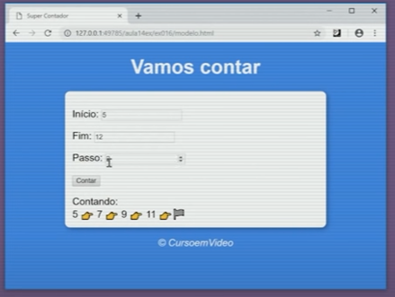

## Passo a passo 
Projeto feito a partir das atividades do curso de Js do Curso em video

## Exemplo

## Notas 

- Valor zero em passo deve ser dado como 1 
- Inicio vazio deve retorna uma msg de erro no contador